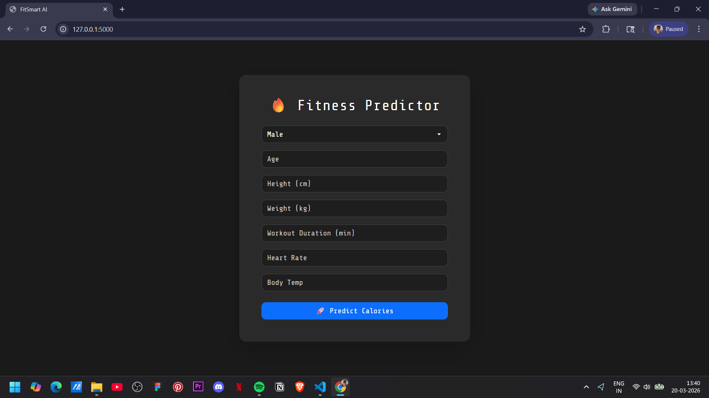
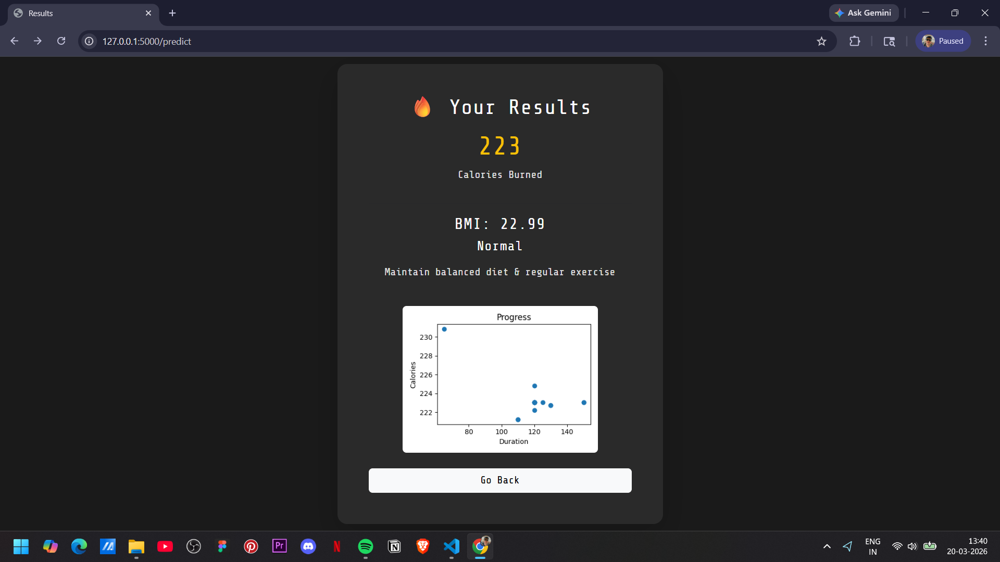

# 🏋️ FitSmart AI

An AI-powered fitness assistant that helps users track health metrics, analyze performance, and get intelligent fitness insights.

---

## 🚀 Features

- 🧠 AI-based fitness recommendations
- 📊 Track workouts, calories, and progress
- 📈 Performance analytics
- 🎯 Goal setting and tracking
- 💡 Smart suggestions based on user data

---

## 🖼️ Project Demo

### 📌 App Preview




### 🎥 Demo Video
[Watch Demo Video](assets/fit-smart-ai.mp4)

---

## 🛠️ Tech Stack

- **Frontend:** (React / HTML / CSS — update this)
- **Backend:** (Python / Flask / Django — update)
- **AI/ML:** (scikit-learn / pandas / numpy — update)
- **Database:** (if used)
- **Tools:** Git, GitHub

---

## ⚙️ How It Works

1. User inputs fitness data (workout, weight, etc.)
2. Data is processed and analyzed
3. AI model generates insights/recommendations
4. Results are displayed in a clean UI

---

## 🧪 Installation & Setup

```bash
# Clone repository
git clone https://github.com/dchoudhry7/fitsmart-ai.git

# Go to folder
cd fitsmart-ai

# Install dependencies
pip install -r requirements.txt

# Run the app
python app.py